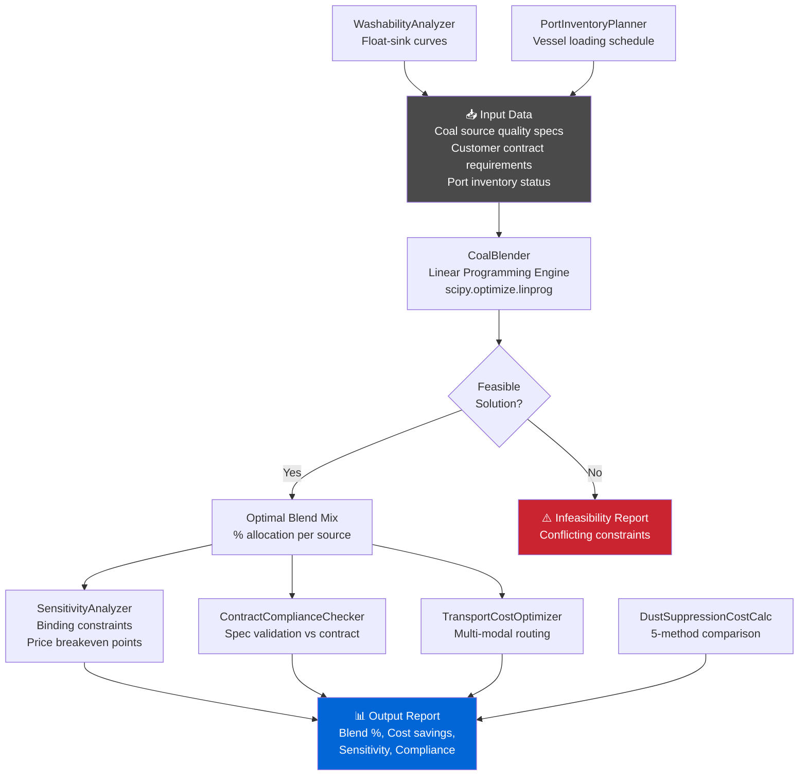

# ⚙️ Coal Blending Optimizer

<p align="center">
  
  
  
  
  
  
</p>

> An optimization toolkit for blending coal batches from multiple sources to meet customer quality specifications at minimum cost. Uses linear programming (scipy) to find optimal mixing ratios across ash, sulfur, moisture, and calorific value constraints. Covers quality optimization, port inventory planning, transport cost optimization, and dust suppression.

---

## 🎯 Features

- **Quality Constraint Optimization** — Meet customer specs for ash %, sulfur %, moisture %, BTU/kg via LP
- **Cost Minimization** — Find the cheapest blend meeting all quality requirements
- **Sensitivity Analysis** — Identify binding constraints and source price breakeven points
- **Washability Analysis** — Float-sink washability curves for run-of-mine coal
- **Transport Cost Optimization** — Multi-modal shipping cost optimization (mine → port → customer)
- **Port Inventory Planner** — Stockpile blending sequences against vessel loading schedules
- **Dust Suppression Cost Calculator** — 5-method dust suppression cost-effectiveness ranking
- **Contract Compliance Checker** — Automated supply contract QA validation against specs

---

## 🚀 Quick Start

### Installation

```bash
git clone https://github.com/achmadnaufal/coal-blending-optimizer.git
cd coal-blending-optimizer
pip install -r requirements.txt
```

### Basic Usage

```python
import pandas as pd
from src.main import CoalBlender

# Define available coal sources
sources = pd.DataFrame({
    'source_name':  ['Indonesia_Pit_A', 'Australia_QLD', 'South_Africa_Witbank'],
    'ash_pct':      [12.5, 8.3, 9.8],
    'sulfur_pct':   [0.4,  0.5, 0.6],
    'moisture_pct': [22.0, 15.0, 18.0],
    'btu_per_kg':   [5600, 6200, 6100],
    'cost_per_ton': [35,   52,   48],
})

# Customer quality specifications
specs = {
    'ash_pct':      {'max': 14.0},
    'sulfur_pct':   {'max': 0.70},
    'moisture_pct': {'max': 20.0},
    'btu_per_kg':   {'min': 5500},
}

blender = CoalBlender(sources, specs)
result = blender.optimize(total_output_tons=1000)

print(f"Optimal blend cost: ${result['total_cost']:,.2f} (${result['cost_per_ton']:.2f}/t)")
for source, pct in result['blend_pcts'].items():
    print(f"  {source}: {pct:.1f}%")
```

**Expected output:**
```
Optimal blend cost: $42,457 ($42.46/t)
  Indonesia_Pit_A: 52.3%
  Australia_QLD: 31.4%
  South_Africa_Witbank: 16.3%
Cost saving vs all-Australia: $9.54/t (-18.3%)
```

---

## 📐 Architecture



---

## 📊 Demo

See [`demo/sample_output.txt`](demo/sample_output.txt) for a full 1,000-tonne optimization run with 3 coal sources, quality compliance verification, and sensitivity analysis.

```
⚙️ OPTIMIZATION RESULT — 1,000 tonne batch
  Indonesia Pit A       : 52.3% | $18,305
  Australia Queensland  : 31.4% | $16,328
  South Africa Witbank  : 16.3% |  $7,824
  ─────────────────────────────────────────
  Total Cost            : $42,457  ($42.46/t)
  vs All-Australia Ref  : -$9,543  (-18.3%)

  Most binding constraint: Moisture% (slack: 0.6pp only)
  Price breakeven (Indo A): $44.20/t
```

---

## 📂 Project Structure

```
coal-blending-optimizer/
├── src/
│   ├── main.py                          # CoalBlender — LP optimization engine
│   ├── blend_compliance_checker.py      # Quality spec compliance
│   ├── contract_compliance_checker.py   # Supply contract QA
│   ├── washability_analyzer.py          # Float-sink washability curves
│   ├── transport_cost_optimizer.py      # Multi-modal transport routing
│   ├── port_inventory_planner.py        # Vessel loading & stockpile sequencing
│   ├── dust_suppression_cost_calculator.py
│   └── data_generator.py               # Synthetic test data generator
├── sample_data/                         # Example coal quality datasets
├── demo/                                # Sample optimization outputs
├── examples/                            # End-to-end usage notebooks
├── tests/                               # pytest unit tests
├── requirements.txt
├── CHANGELOG.md
└── CONTRIBUTING.md
```

---

## 🔧 Key Modules

| Module | Description |
|--------|-------------|
| `CoalBlender` | LP-based blend optimizer for multi-source, multi-constraint problems |
| `SensitivityAnalyzer` | Binding constraint identification and source price breakeven |
| `WashabilityAnalyzer` | Float-sink curves and yield/quality trade-off analysis |
| `TransportCostOptimizer` | Multi-modal route optimization (truck → rail → port) |
| `PortInventoryPlanner` | Stockpile blend sequencing against vessel loading windows |
| `DustSuppressionCostCalculator` | Cost-effectiveness ranking across 5 suppression methods |
| `ContractComplianceChecker` | Automated spec validation against buyer contract requirements |

---

## 📏 Quality Parameters & Standards

| Parameter | Standard | Typical Range |
|-----------|----------|--------------|
| Ash Content | ISO 1171 | 5–25% |
| Sulfur Content | ASTM D3177 | 0.2–1.5% |
| Moisture | ISO 589 | 8–30% |
| Calorific Value (GAR) | ASTM D5865 | 4,500–7,000 BTU/kg |

---

## 🧪 Testing

```bash
pytest tests/ -v
```

---

## 📄 License

MIT License — see [LICENSE](LICENSE)

---

> Built by [Achmad Naufal](https://github.com/achmadnaufal) | Lead Data Analyst | Power BI · SQL · Python · GIS
