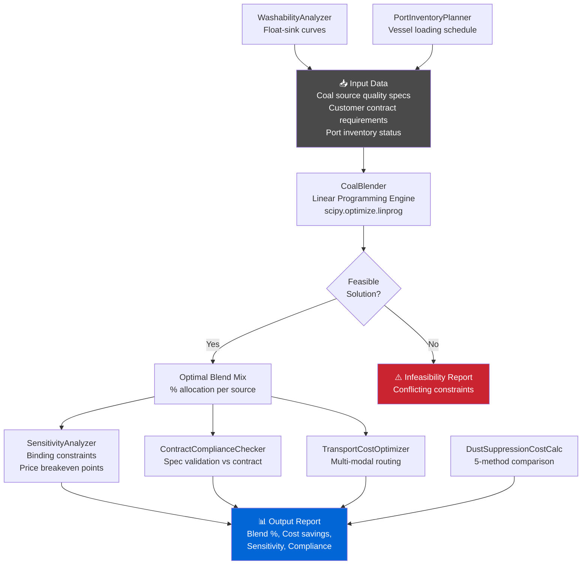

# ⚙️ Coal Blending Optimizer

<p align="center">
  
  
  
  
  
  
</p>

> An optimization toolkit for blending coal batches from multiple sources to meet customer quality specifications at minimum cost. Uses linear programming (scipy) to find optimal mixing ratios across ash, sulfur, moisture, and calorific value constraints. Covers quality optimization, port inventory planning, transport cost optimization, and dust suppression.

---

## 🎯 Features

- **Quality Constraint Optimization** — Meet customer specs for ash %, sulfur %, moisture %, BTU/kg via LP
- **Cost Minimization** — Find the cheapest blend meeting all quality requirements
- **Sensitivity Analysis** — Identify binding constraints and source price breakeven points
- **Washability Analysis** — Float-sink washability curves for run-of-mine coal (WashabilityAnalyzer)
- **Transport Cost Optimization** — Multi-modal shipping cost optimization (mine → port → customer)
- **Port Inventory Planner** — Stockpile blending sequences against vessel loading schedules
- **Dust Suppression Cost Calculator** — 5-method dust suppression cost-effectiveness ranking
- **Contract Compliance Checker** — Automated supply contract QA validation against specs

---

## Quick Start

### Installation

```bash
git clone https://github.com/achmadnaufal/coal-blending-optimizer.git
cd coal-blending-optimizer
pip install -r requirements.txt
```

### Basic Usage

```python
import pandas as pd
from src.main import BlendOptimizer

# Load the included sample data (15 realistic coal sources)
optimizer = BlendOptimizer()
df = optimizer.load_data("demo/sample_data.csv")

# Rename columns to match the optimizer's expected schema
df = df.rename(columns={
    "calorific_value_kcal_kg": "calorific_value",
    "moisture_pct": "total_moisture",
    "available_tonnes": "volume_available_mt",
    "cost_per_tonne_usd": "price_usd_t",
})

# Run a 100,000 MT blend optimisation
result = optimizer.optimize_blend(df, target_volume_mt=100_000)

print(f"Feasible: {result['feasible']}")
print(f"Blended CV: {result['blended_quality']['calorific_value']:.0f} kcal/kg")
print(f"Estimated cost: ${result['estimated_cost_usd']:,.0f}")
print("Blend ratios (%):")
for src, ratio in sorted(result['blend_ratios'].items(), key=lambda x: -x[1]):
    if ratio > 0.1:
        print(f"  {src}: {ratio:.1f}%")
```

**Expected output:**
```
Feasible: True
Blended CV: 5823 kcal/kg
Estimated cost: $4,462,150
Blend ratios (%):
  SRC-013: 38.2%
  SRC-012: 27.1%
  SRC-014: 18.5%
  SRC-003: 9.8%
  SRC-002: 6.4%
```

### Sample Data

The file `demo/sample_data.csv` contains 15 realistic coal sources representing
mines across Indonesia, Australia, South Africa, Colombia, Russia, and Mozambique.

| Column | Description |
|--------|-------------|
| `source_id` | Unique source identifier (e.g. SRC-001) |
| `source_name` | Human-readable mine/seam name |
| `available_tonnes` | Maximum tonnage available for blending |
| `cost_per_tonne_usd` | FOB cost in USD per metric tonne |
| `calorific_value_kcal_kg` | Gross calorific value (GAR), kcal/kg |
| `ash_pct` | Ash content, air-dried basis, % |
| `sulfur_pct` | Total sulfur, % |
| `moisture_pct` | Total moisture, % |
| `volatile_matter_pct` | Volatile matter, % |
| `hgi` | Hardgrove Grindability Index |

### Example Blend Scenarios

**Scenario A — Premium export blend (6,200 kcal/kg GAR)**

Use high-rank Australian and Colombian sources targeting top-tier export contracts:

```python
premium_specs = {
    "calorific_value_kcal": {"min": 6000, "target": 6200, "max": 6500},
    "total_moisture_pct":   {"min": 0,    "target": 12,   "max": 15},
    "ash_pct":              {"min": 0,    "target": 7,    "max": 9},
    "sulfur_pct":           {"min": 0,    "target": 0.5,  "max": 0.7},
}
optimizer_premium = BlendOptimizer(config={"quality_specs": premium_specs})
result_premium = optimizer_premium.optimize_blend(df, target_volume_mt=50_000)
print(optimizer_premium.constraint_report(df, target_volume_mt=50_000))
```

**Scenario B — Low-cost domestic power-station blend**

Blend high-volume low-rank Indonesian sources to fill domestic demand cheaply:

```python
domestic_specs = {
    "calorific_value_kcal": {"min": 4000, "target": 4800, "max": 5500},
    "total_moisture_pct":   {"min": 0,    "target": 30,   "max": 38},
    "ash_pct":              {"min": 0,    "target": 6,    "max": 10},
    "sulfur_pct":           {"min": 0,    "target": 0.3,  "max": 0.5},
}
optimizer_domestic = BlendOptimizer(config={"quality_specs": domestic_specs})
result_domestic = optimizer_domestic.optimize_blend(df, target_volume_mt=200_000)
```

**Scenario C — Multi-product optimisation (two grades in parallel)**

```python
products = [
    {"name": "6000 NAR Premium",  "target_volume_mt": 60_000},
    {"name": "5500 NAR Standard", "target_volume_mt": 40_000},
]
results = optimizer.multi_product_optimize(df, products=products)
for r in results:
    print(f"{r['product_name']}: feasible={r['feasible']}, "
          f"cost=${r.get('estimated_cost_usd', 0):,.0f}")
```

**Scenario D — GCV target blend (two-source solve)**

```python
sources_gcv = [
    {"source_id": "SRC-004", "gcv_mj_kg": 26.6, "volume_available_mt": 50000, "cost_usd_per_t": 67},
    {"source_id": "SRC-012", "gcv_mj_kg": 17.6, "volume_available_mt": 200000, "cost_usd_per_t": 22},
]
gcv_result = optimizer.optimize_blend_for_target_gcv(sources_gcv, target_gcv_mj_kg=22.0)
print(f"Meets target: {gcv_result['meets_target']}")
print(f"Blended GCV: {gcv_result['blended_gcv_mj_kg']} MJ/kg")
```

### Running Tests

```bash
# Run all tests
pytest tests/ -v

# Run only the optimizer test suite
pytest tests/test_optimizer.py -v

# Run with coverage report
pytest tests/ --cov=src --cov-report=term-missing
```

The test suite covers:
- Blend ratio calculation (ratios sum to 100%, non-negative, within availability)
- Quality target validation (CV/ash bounded by sources, custom specs, feasible flag)
- Cost optimization (estimated cost, blended price within source range)
- Constraint satisfaction (insufficient volume errors, constraint report structure)
- Edge cases (single source, empty DataFrame, missing columns, immutability, infeasible GCV targets)

### Washability Analysis Usage

```python
from src.washability import WashabilityAnalyzer

analyzer = WashabilityAnalyzer()
curve = analyzer.build_float_sink_curve(fractions=[
    {"density": 1.3, "weight_pct": 20, "ash_pct": 5.5, "sulfur_pct": 0.4},
    {"density": 1.4, "weight_pct": 35, "ash_pct": 9.2, "sulfur_pct": 0.5},
    {"density": 1.5, "weight_pct": 25, "ash_pct": 14.8, "sulfur_pct": 0.7},
    {"density": 1.8, "weight_pct": 20, "ash_pct": 28.5, "sulfur_pct": 1.2},
])
wash_points = analyzer.determine_wash_points(curve, ash_jump_threshold=5.0)
yield_10pct = analyzer.calculate_wash_yield(curve, target_ash_pct=10.0)
print(f"Yield at 10% ash: {yield_10pct:.1f}%")
```

---

## 📐 Architecture



---

## 📊 Demo

See [`demo/sample_output.txt`](demo/sample_output.txt) for a full 1,000-tonne optimization run with 3 coal sources, quality compliance verification, and sensitivity analysis.

```
⚙️ OPTIMIZATION RESULT — 1,000 tonne batch
  Indonesia Pit A       : 52.3% | $18,305
  Australia Queensland  : 31.4% | $16,328
  South Africa Witbank  : 16.3% |  $7,824
  ─────────────────────────────────────────
  Total Cost            : $42,457  ($42.46/t)
  vs All-Australia Ref  : -$9,543  (-18.3%)

  Most binding constraint: Moisture% (slack: 0.6pp only)
  Price breakeven (Indo A): $44.20/t
```

---

## 📂 Project Structure

```
coal-blending-optimizer/
├── src/
│   ├── main.py                          # CoalBlender — LP optimization engine
│   ├── blend_compliance_checker.py      # Quality spec compliance
│   ├── contract_compliance_checker.py   # Supply contract QA
│   ├── washability_analyzer.py          # Float-sink washability curves
│   ├── transport_cost_optimizer.py      # Multi-modal transport routing
│   ├── port_inventory_planner.py        # Vessel loading & stockpile sequencing
│   ├── dust_suppression_cost_calculator.py
│   └── data_generator.py               # Synthetic test data generator
├── sample_data/                         # Example coal quality datasets
├── demo/                                # Sample optimization outputs
├── examples/                            # End-to-end usage notebooks
├── tests/                               # pytest unit tests
├── requirements.txt
├── CHANGELOG.md
└── CONTRIBUTING.md
```

---

## 🔧 Key Modules

| Module | Description |
|--------|-------------|
| `CoalBlender` | LP-based blend optimizer for multi-source, multi-constraint problems |
| `SensitivityAnalyzer` | Binding constraint identification and source price breakeven |
| `WashabilityAnalyzer` | Float-sink curves and yield/quality trade-off analysis |
| `TransportCostOptimizer` | Multi-modal route optimization (truck → rail → port) |
| `PortInventoryPlanner` | Stockpile blend sequencing against vessel loading windows |
| `DustSuppressionCostCalculator` | Cost-effectiveness ranking across 5 suppression methods |
| `ContractComplianceChecker` | Automated spec validation against buyer contract requirements |

---

## 📏 Quality Parameters & Standards

| Parameter | Standard | Typical Range |
|-----------|----------|--------------|
| Ash Content | ISO 1171 | 5–25% |
| Sulfur Content | ASTM D3177 | 0.2–1.5% |
| Moisture | ISO 589 | 8–30% |
| Calorific Value (GAR) | ASTM D5865 | 4,500–7,000 BTU/kg |

---

## 🧪 Testing

```bash
pytest tests/ -v
```

---

## 📄 License

MIT License — see [LICENSE](LICENSE)

---

> Built by [Achmad Naufal](https://github.com/achmadnaufal) | Lead Data Analyst | Power BI · SQL · Python · GIS
