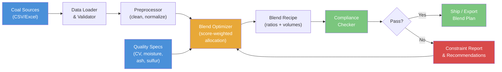

# Coal Blending Optimizer

Score-based coal blend optimization engine that finds optimal mix ratios from multiple source stockpiles to meet product quality specifications (calorific value, moisture, ash, sulfur) while minimizing delivered cost.

---

## Features

- **Multi-source blend optimization** — score-weighted allocation across N coal sources with volume constraints
- **Quality compliance checking** — validates blended product against contract specs (ASTM/ISO basis) with PASS/WARN/FAIL status
- **Constraint reporting** — shows headroom to spec limits and flags binding parameters
- **Sensitivity analysis** — sweeps quality parameters to evaluate blend robustness
- **Multi-product optimization** — sequential blend planning for multiple product grades from shared stockpiles
- **Washability analysis** — float-sink curve construction, wash-point identification, and yield-at-ash calculations
- **Transport cost optimization** — mine-to-port multi-modal logistics cost modeling
- **Environmental impact estimation** — blended SO2, NOx, ash, and carbon intensity metrics
- **Comprehensive input validation** — rejects negative quality values, percentages >100, inverted spec bounds, and empty sources

## Quick Start

```bash
# Clone the repository
git clone https://github.com/achmadnaufal/coal-blending-optimizer.git
cd coal-blending-optimizer

# Create virtual environment and install dependencies
python -m venv .venv
source .venv/bin/activate
pip install -r requirements.txt

# Run the optimizer
python examples/cli_demo.py
```

## Usage

### CLI

```bash
# Default run (uses sample_data/stockpiles.csv, 100k MT target)
python examples/cli_demo.py

# Custom data file and target volume
python examples/cli_demo.py --data sample_data/stockpiles.csv --target-volume 80000
```

### Python API

```python
from src.main import BlendOptimizer

optimizer = BlendOptimizer()
df = optimizer.load_data("sample_data/stockpiles.csv")
result = optimizer.optimize_blend(df, target_volume_mt=100_000)

print(result["blend_ratios"])    # {source_id: ratio_pct}
print(result["blended_quality"]) # weighted-average quality values
print(result["feasible"])        # True if all specs met
print(result["estimated_cost_usd"])  # total blend cost USD
```

### Multi-product optimization

```python
products = [
    {"name": "6000 NAR Export",  "target_volume_mt": 60_000},
    {"name": "5500 NAR Domestic","target_volume_mt": 40_000},
]
results = optimizer.multi_product_optimize(df, products=products)
for r in results:
    print(r["product_name"], r["feasible"], r["blended_quality"])
```

### GCV-target blend

```python
sources = [
    {"source_id": "KAL-HCV", "gcv_mj_kg": 27.2, "volume_available_mt": 10_000, "cost_usd_per_t": 55},
    {"source_id": "KAL-LCV", "gcv_mj_kg": 19.8, "volume_available_mt": 20_000, "cost_usd_per_t": 25},
]
result = optimizer.optimize_blend_for_target_gcv(sources, target_gcv_mj_kg=24.0)
print(result["blend_ratios"])          # {source_id: fraction}
print(result["blended_gcv_mj_kg"])     # 24.0
print(result["meets_target"])          # True
```

### Sensitivity analysis

```python
sensitivity = optimizer.sensitivity_analysis(df, param="ash_pct", delta_pct=10.0)
print(sensitivity[["delta_pct", "blended_cv", "feasible"]])
```

## Sample Output

```
=================================================================
  COAL BLENDING OPTIMIZER
=================================================================

[1] Loaded 8 coal sources from sample_data/stockpiles.csv
    Columns: ['source_id', 'calorific_value', 'total_moisture', 'ash_pct',
              'sulfur_pct', 'volume_available_mt', 'price_usd_t']

[2] Optimizing blend for 100,000 MT target volume...

[3] Blend Ratios:
    Source     Ratio (%)    Volume (MT)
    ---------- ------------ --------------
    SEAM_A     15.04        15,038.5
    SEAM_B     11.50        11,501.9
    SEAM_C     13.49        13,493.4
    SEAM_G     15.70        15,695.8

[4] Blended Quality:
    calorific_value      6045.269
    total_moisture       10.236
    ash_pct              6.179
    sulfur_pct           0.542

[5] Quality Compliance Check:
    Parameter            Value      Min      Max      Target   Status
    -------------------- ---------- -------- -------- -------- ------
    calorific_value      6045.269   5800     6300     6000     PASS
    total_moisture       10.236     0        14       10       PASS
    ash_pct              6.179      0        8        6        PASS
    sulfur_pct           0.542      0        0.8      0.5      PASS

    Feasible: YES - All specs met
    Estimated Cost: $7,834,980.59 | Blended Price: $78.35/t

=================================================================
  Optimization complete.
=================================================================
```

## Sample Data

The demo dataset `demo/sample_data.csv` contains 15 realistic Indonesian sub-bituminous
coal sources (GAR range 3800–6500 kcal/kg) sourced from Kalimantan and Sumatra mines.

| Column | Unit | Description |
|--------|------|-------------|
| `source_id` | — | Unique source identifier |
| `mine_name` | — | Mine / pit name |
| `calorific_value_kcal` | kcal/kg | Gross calorific value (GAR) |
| `total_moisture_pct` | % | Total moisture (as-received) |
| `ash_content_pct` | % | Ash content (air-dried) |
| `sulfur_pct` | % | Total sulfur |
| `volatile_matter_pct` | % | Volatile matter |
| `available_tonnes` | MT | Available stockpile tonnage |
| `cost_per_tonne_usd` | USD/t | Mine gate or FOB cost |

## Running Tests

```bash
# Install test dependencies (already in requirements.txt)
pip install pytest

# Run all tests with verbose output
pytest tests/ -v

# Run only the core optimizer tests
pytest tests/test_blend_optimization.py -v

# Run with coverage report
pip install pytest-cov
pytest tests/ --cov=src --cov-report=term-missing
```

Expected output: **433+ tests passing** across 15 test modules.

## Tech Stack

| Component | Technology |
|-----------|-----------|
| Language | Python 3.9+ |
| Data | pandas, NumPy |
| Optimization | SciPy |
| CLI Output | Rich |
| Testing | pytest |

## Architecture



## Project Structure

```
coal-blending-optimizer/
  src/
    main.py                          # Core BlendOptimizer class (type-hinted, validated)
    blend_compliance_checker.py      # Contract spec compliance with WARN bands
    washability.py                   # Float-sink washability curves
    washability_analyzer.py          # DMS yield-vs-ash curve modelling
    transport_cost_optimizer.py      # Mine-to-port multi-modal logistics
    contract_compliance_checker.py   # Price adjustment + rejection logic
    port_inventory_planner.py        # Terminal inventory projection
    dust_suppression_cost_calculator.py
    wash_plant_efficiency_calculator.py
    dragline_productivity_model.py
    stockpile_segregation_planner.py
    data_generator.py
  demo/
    sample_data.csv                  # 15 Indonesian sub-bituminous coal sources
    sample_output.txt                # Example CLI run output
  sample_data/
    stockpiles.csv                   # 8-source stockpile dataset
    sample_data.csv                  # 15-source extended dataset
  examples/
    cli_demo.py                      # CLI entry point
    basic_usage.py                   # Minimal Python usage
  tests/
    test_blend_optimization.py       # 78 tests: validation, quality, immutability
    test_optimizer.py                # 31 tests: ratio, cost, constraints
    test_main.py                     # Core API tests
    test_blend_compliance_checker.py
    test_washability.py / test_washability_analyzer.py
    test_transport_cost_optimizer.py
    test_contract_compliance_checker.py
    test_port_inventory_planner.py
    ...and more
  requirements.txt
  CHANGELOG.md
```

---

> Built by [Achmad Naufal](https://github.com/achmadnaufal) | Lead Data Analyst | Power BI . SQL . Python . GIS
