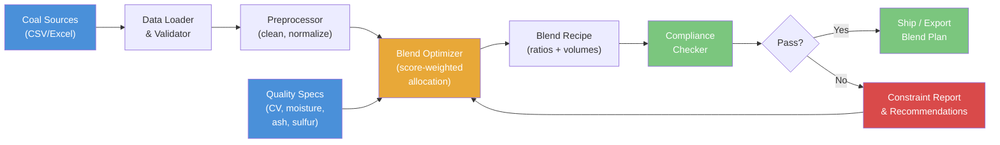

# Coal Blending Optimizer

Score-based coal blend optimization engine that finds optimal mix ratios from multiple source stockpiles to meet product quality specifications (calorific value, moisture, ash, sulfur) while minimizing delivered cost.

---

## Features

- **Multi-source blend optimization** -- score-weighted allocation across N coal sources with volume constraints
- **Quality compliance checking** -- validates blended product against contract specs (ASTM/ISO basis) with PASS/WARN/FAIL status
- **Constraint reporting** -- shows headroom to spec limits and flags binding parameters
- **Sensitivity analysis** -- sweeps quality parameters to evaluate blend robustness
- **Multi-product optimization** -- sequential blend planning for multiple product grades from shared stockpiles
- **Washability analysis** -- float-sink curve construction, wash-point identification, and yield-at-ash calculations
- **Transport cost optimization** -- mine-to-port multi-modal logistics cost modeling
- **Environmental impact estimation** -- blended SO2, NOx, ash, and carbon intensity metrics

## Quick Start

```bash
# Clone the repository
git clone https://github.com/achmadnaufal/coal-blending-optimizer.git
cd coal-blending-optimizer

# Create virtual environment and install dependencies
python -m venv .venv
source .venv/bin/activate
pip install -r requirements.txt

# Run the optimizer
python examples/cli_demo.py
```

## Usage

### CLI

```bash
# Default run (uses sample_data/stockpiles.csv, 100k MT target)
python examples/cli_demo.py

# Custom data file and target volume
python examples/cli_demo.py --data sample_data/stockpiles.csv --target-volume 80000
```

### Sample Output

```
=================================================================
  COAL BLENDING OPTIMIZER
=================================================================

[1] Loaded 8 coal sources from sample_data/stockpiles.csv
    Columns: ['source_id', 'calorific_value', 'total_moisture', 'ash_pct', 'sulfur_pct', 'volume_available_mt', 'price_usd_t']

[2] Source Quality Summary:
    Source     CV (kcal)    Moisture%    Ash%     Sulfur%    Avail (MT)   Price $/t
    ---------- ------------ ------------ -------- ---------- ------------ ---------
    SEAM_A     6,250        8.2          4.8      0.38       45,000       87.5
    SEAM_B     5,920        11.5         7.2      0.65       72,000       71.0
    SEAM_C     6,080        9.8          5.9      0.48       60,000       79.5
    SEAM_D     5,780        13.2         8.1      0.78       38,000       67.0
    SEAM_E     6,150        8.9          5.2      0.42       55,000       83.0
    SEAM_F     5,850        12.0         7.8      0.72       48,000       69.5
    SEAM_G     6,320        7.5          4.2      0.35       30,000       92.0
    SEAM_H     5,700        14.1         8.5      0.82       65,000       63.0

[3] Optimizing blend for 100,000 MT target volume...

[4] Blend Ratios:
    Source     Ratio (%)    Volume (MT)
    ---------- ------------ --------------
    SEAM_A     15.04        15,038.5
    SEAM_B     11.50        11,501.9
    SEAM_C     13.49        13,493.4
    SEAM_D     9.94         9,937.3
    SEAM_E     14.38        14,379.0
    SEAM_F     10.67        10,672.9
    SEAM_G     15.70        15,695.8
    SEAM_H     9.28         9,281.2

[5] Blended Quality:
    calorific_value      6045.269
    total_moisture       10.236
    ash_pct              6.179
    sulfur_pct           0.542

[6] Quality Compliance Check:
    Parameter            Value      Min      Max      Target   Status
    -------------------- ---------- -------- -------- -------- ------
    calorific_value      6045.269   5800     6300     6000     PASS
    total_moisture       10.236     0        14       10       PASS
    ash_pct              6.179      0        8        6        PASS
    sulfur_pct           0.542      0        0.8      0.5      PASS

    Feasible: YES - All specs met
    Estimated Cost: $7,834,980.59
    Blended Price:  $78.35/t

[7] Constraint Report:
    Parameter            Blended    Target     Headroom   Status
    -------------------- ---------- ---------- ---------- --------
    calorific_value      6045.269   6000.0     254.731    OK
    total_moisture       10.236     10.0       3.764      OK
    ash_pct              6.179      6.0        1.821      OK
    sulfur_pct           0.542      0.5        0.258      OK

[8] Blend Compliance Report:
    Blend ID:       BLEND-2024-001
    Overall Status: PASS
    Compliance:     100%

=================================================================
  Optimization complete.
=================================================================
```

### Python API

```python
from src.main import BlendOptimizer

optimizer = BlendOptimizer()
df = optimizer.load_data("sample_data/stockpiles.csv")
result = optimizer.optimize_blend(df, target_volume_mt=100_000)

print(result["blend_ratios"])    # {source_id: ratio_pct}
print(result["blended_quality"]) # weighted-average quality values
print(result["feasible"])        # True if all specs met
```

## Tech Stack

| Component | Technology |
|-----------|-----------|
| Language | Python 3.9+ |
| Data | pandas, NumPy |
| Optimization | SciPy (linear programming) |
| CLI Output | Rich |
| Testing | pytest |

## Architecture



## Project Structure

```
coal-blending-optimizer/
  src/
    main.py                        # Core BlendOptimizer class
    blend_compliance_checker.py    # Contract spec compliance
    washability.py                 # Float-sink washability curves
    transport_cost_optimizer.py    # Mine-to-port logistics
    data_generator.py              # Sample data generation
  examples/
    cli_demo.py                    # CLI entry point
    basic_usage.py                 # Minimal Python usage
  sample_data/
    stockpiles.csv                 # 8-source stockpile dataset
    sample_data.csv                # 15-source extended dataset
  tests/                           # pytest test suite
  requirements.txt
```

---

> Built by [Achmad Naufal](https://github.com/achmadnaufal) | Lead Data Analyst | Power BI . SQL . Python . GIS
