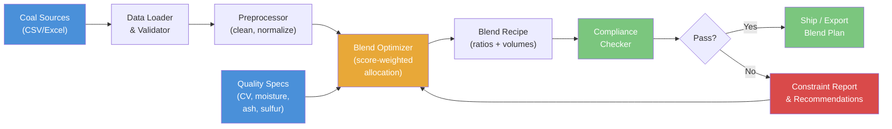

# Coal Blending Optimizer

  

Score-based coal blend optimization engine that finds optimal mix ratios from multiple source stockpiles to meet product quality specifications (calorific value, moisture, ash, sulfur) while minimizing delivered cost.

## Features

- **Cost-minimising LP optimizer** — `scipy.optimize.linprog` (HiGHS) solver that finds the provably cheapest blend meeting min/max quality bands on CV, ash, sulfur, and moisture
- **Revenue-maximising LP optimizer** — finds the most profitable blend under a linear index-linked price formula (base price plus per-kcal premium, minus per-pct ash/sulfur/moisture penalties)
- **Blend scenario comparator** — side-by-side ranking of named candidate recipes against a single quality spec
- **Score-weighted allocator** — fast, feasibility-aware allocator across N stockpiles with volume constraints
- **Quality compliance checking** — validates blended product against contract specs (ASTM/ISO basis) with PASS/WARN/FAIL status
- **Constraint reporting** — shows headroom to spec limits and flags binding parameters
- **Sensitivity analysis** — sweeps quality parameters to evaluate blend robustness
- **Multi-product optimization** — sequential blend planning for multiple product grades from shared stockpiles
- **Cost-per-GJ and carbon-intensity calculators** — USD/GJ delivered-cost comparison and Scope-1 CO2e per tonne
- **Slagging & fouling index calculator** — ash-chemistry R_s / R_f indices (Attig-Duzy 1969, Bryers 1996) with low/medium/high/severe classification for boiler-deposition risk screening
- **Washability analysis** — float-sink curve construction, wash-point identification, and yield-at-ash calculations
- **Transport cost optimization** — mine-to-port multi-modal logistics cost modeling
- **Comprehensive input validation** — rejects negative quality values, percentages >100, inverted spec bounds, and empty sources

## Architecture



## Quick Start

```bash
# Clone the repository
git clone https://github.com/achmadnaufal/coal-blending-optimizer.git
cd coal-blending-optimizer

# Create virtual environment and install dependencies
python -m venv .venv
source .venv/bin/activate
pip install -r requirements.txt

# Run the optimizer
python examples/cli_demo.py
```

## Quickstart: meet a buyer spec from the demo dataset

This runnable snippet loads the 15-row Indonesian demo catalogue, defines a
typical export buyer specification (CV >= 5800 kcal/kg, ash <= 8.0 %, sulfur
<= 0.6 %), and computes the cost-minimising blend of 100,000 tonnes.

```python
import pandas as pd
from src.lp_blend_optimizer import LPBlendOptimizer

df = pd.read_csv("demo/sample_data.csv")

buyer_spec = {
    "cv_kcal_kg":  {"min": 5800},
    "ash_pct":     {"max": 8.0},
    "sulfur_pct":  {"max": 0.6},
}

result = LPBlendOptimizer().solve(
    df, target_tonnage=100_000, constraints=buyer_spec
)

if result.feasible:
    print(f"Status:       {result.status}")
    print(f"Cost / tonne: ${result.cost_per_tonne_usd:,.2f}")
    print(f"Total cost:   ${result.total_cost_usd:,.2f}")
    print(f"Binding:      {result.binding_constraints}")
    print("Allocation (tonnes):")
    for pile, tonnes in result.allocation_tonnes.items():
        if tonnes > 0:
            print(f"  {pile:<14} {tonnes:>10,.1f}")
else:
    # Infeasibility is reported, never raised: inspect the diagnostic.
    print(f"Infeasible: {result.message}")
```

To *maximise margin* instead of minimise cost, swap in the
`RevenueBlendOptimizer` and pass a price formula (see below).

## Usage

### CLI

```bash
# Default run (uses sample_data/stockpiles.csv, 100k MT target)
python examples/cli_demo.py

# Custom data file and target volume
python examples/cli_demo.py --data sample_data/stockpiles.csv --target-volume 80000
```

### Python API

```python
from src.main import BlendOptimizer

optimizer = BlendOptimizer()
df = optimizer.load_data("sample_data/stockpiles.csv")
result = optimizer.optimize_blend(df, target_volume_mt=100_000)

print(result["blend_ratios"])    # {source_id: ratio_pct}
print(result["blended_quality"]) # weighted-average quality values
print(result["feasible"])        # True if all specs met
print(result["estimated_cost_usd"])  # total blend cost USD
```

### Multi-product optimization

```python
products = [
    {"name": "6000 NAR Export",  "target_volume_mt": 60_000},
    {"name": "5500 NAR Domestic","target_volume_mt": 40_000},
]
results = optimizer.multi_product_optimize(df, products=products)
for r in results:
    print(r["product_name"], r["feasible"], r["blended_quality"])
```

### GCV-target blend

```python
sources = [
    {"source_id": "KAL-HCV", "gcv_mj_kg": 27.2, "volume_available_mt": 10_000, "cost_usd_per_t": 55},
    {"source_id": "KAL-LCV", "gcv_mj_kg": 19.8, "volume_available_mt": 20_000, "cost_usd_per_t": 25},
]
result = optimizer.optimize_blend_for_target_gcv(sources, target_gcv_mj_kg=24.0)
print(result["blend_ratios"])          # {source_id: fraction}
print(result["blended_gcv_mj_kg"])     # 24.0
print(result["meets_target"])          # True
```

### Sensitivity analysis

```python
sensitivity = optimizer.sensitivity_analysis(df, param="ash_pct", delta_pct=10.0)
print(sensitivity[["delta_pct", "blended_cv", "feasible"]])
```

## New: Scope-1 Carbon Intensity Calculator

Calculate Scope-1 CO2-equivalent emission intensity (kg CO2e per tonne produced)
for any coal blend, broken down by diesel combustion, fugitive methane (CH4),
and explosive detonation residuals. Follows IPCC AR6 GWP100 factors (CH4 = 29.8).

### Step-by-step usage

**Step 1 — Define an emission profile per source**

```python
from src.carbon_intensity_calculator import SourceEmissionProfile

# Kalimantan open-cut source — higher diesel intensity, moderate CH4
seam_a = SourceEmissionProfile(
    source_id="SEAM_A",
    diesel_litres_per_tonne=4.0,   # L diesel / tonne produced
    ch4_m3_per_tonne=1.2,          # m3 fugitive CH4 / tonne mined
    explosive_kg_co2e_per_tonne=0.05,
)

# Sumatra source — lower strip ratio, less diesel
seam_b = SourceEmissionProfile(
    source_id="SEAM_B",
    diesel_litres_per_tonne=3.0,
    ch4_m3_per_tonne=0.6,
)
```

**Step 2 — Build the calculator**

```python
from src.carbon_intensity_calculator import CarbonIntensityCalculator

calc = CarbonIntensityCalculator([seam_a, seam_b])
```

**Step 3 — Define the blend recipe and compute intensity**

```python
from src.carbon_intensity_calculator import BlendSource

blend = [
    BlendSource("SEAM_A", fraction=0.6),
    BlendSource("SEAM_B", fraction=0.4),
]

result = calc.calculate(blend, volume_mt=100_000)

print(f"Blend intensity : {result.blended_intensity_kg_co2e_per_tonne:.2f} kg CO2e/t")
print(f"  Diesel share  : {result.diesel_contribution_kg_co2e_per_tonne:.2f} kg CO2e/t")
print(f"  CH4 share     : {result.ch4_contribution_kg_co2e_per_tonne:.2f} kg CO2e/t")
print(f"  Explosive     : {result.explosive_contribution_kg_co2e_per_tonne:.2f} kg CO2e/t")
print(f"Total batch CO2e: {result.total_co2e_tonnes:.1f} t CO2e")
print(f"Per-source      : {result.source_breakdown}")
```

**Expected output (approximate)**

```
Blend intensity : 36.60 kg CO2e/t
  Diesel share  : 18.55 kg CO2e/t
  CH4 share     : 18.01 kg CO2e/t
  Explosive     : 0.04 kg CO2e/t
Total batch CO2e: 3660.0 t CO2e
Per-source      : {'SEAM_A': 21.96, 'SEAM_B': 14.64}
```

**Step 4 — Query a single source intensity**

```python
intensity = calc.intensity_for_source("SEAM_A")
print(f"SEAM_A standalone: {intensity:.2f} kg CO2e/t")
```

### Inputs validated at boundaries

- Empty profile list or blend recipe → `ValueError`
- Blend fractions not summing to 1.0 (±0.001) → `ValueError`
- Negative diesel / CH4 / explosive factors → `ValueError`
- Diesel consumption > 50 L/t or CH4 > 25 m3/t → `ValueError`
- `volume_mt` <= 0 → `ValueError`
- Unregistered `source_id` in blend → `ValueError`
- Duplicate `source_id` in profile list → `ValueError`

---

## New: Slagging & Fouling Index Calculator

Screens coals (and blends) for boiler ash-deposition risk using classic
oxide-chemistry indices from Attig & Duzy (1969) and Bryers (1996). Computes
B/A ratio, silica ratio S/A, Fe2O3/CaO, slagging index `R_s = (B/A) * S_dry`,
and fouling index `R_f = (B/A) * (Na2O + K2O)` (bituminous) or `R_f = Na2O`
(lignitic). Each index is classified `low` / `medium` / `high` / `severe`
per Bryers's Table 2.5 bands.

### Step-by-step usage

```python
import pandas as pd
from src.slagging_fouling_index import (
    AshComposition,
    BlendFraction,
    CoalRank,
    SlaggingFoulingIndexCalculator,
)

df = pd.read_csv("sample_data/slagging_fouling_samples.csv")

profiles = [
    AshComposition(
        source_id=row.source_id,
        sio2=row.sio2_pct, al2o3=row.al2o3_pct, fe2o3=row.fe2o3_pct,
        cao=row.cao_pct, mgo=row.mgo_pct, na2o=row.na2o_pct,
        k2o=row.k2o_pct, tio2=row.tio2_pct,
        sulfur_dry_pct=row.sulfur_dry_pct,
        rank=CoalRank(row.rank),
    )
    for row in df.itertuples()
]

calc = SlaggingFoulingIndexCalculator(profiles)

# Screen every source on its own
for sid, report in calc.compare_sources().items():
    print(f"{sid:12} R_s={report.slagging_index:.2f} ({report.slagging_class})"
          f"  R_f={report.fouling_index:.2f} ({report.fouling_class})")

# Evaluate a 60/40 blend of a low-risk Australian bituminous and a
# high-Fe Indonesian lignitic to bring slagging back under control
blend_report = calc.evaluate([
    BlendFraction("MTK_BULGA", 0.6),
    BlendFraction("BAN_LAHAT", 0.4),
])
print(f"Blended R_s={blend_report.slagging_index:.2f} "
      f"({blend_report.slagging_class})")
print(f"Blended R_f={blend_report.fouling_index:.2f} "
      f"({blend_report.fouling_class})")
print(f"B/A={blend_report.base_acid_ratio:.2f}, "
      f"S/A={blend_report.silica_ratio:.2f}")
```

### Classification bands (Bryers 1996)

| Class  | R_s (slagging) | R_f (fouling) |
|--------|----------------|----------------|
| low    | < 0.6          | < 0.2          |
| medium | 0.6 – 2.0      | 0.2 – 0.5      |
| high   | 2.0 – 2.6      | 0.5 – 1.0      |
| severe | >= 2.6         | >= 1.0         |

### Validated boundaries

- Oxide sum outside [70 %, 105 %] → `ValueError` (incomplete / unit error)
- Any oxide < 0 or > 100 wt-% → `ValueError`
- `sulfur_dry_pct` outside [0, 15] → `ValueError`
- Blend fractions not summing to 1.0 (±0.001) → `ValueError`
- Duplicate `source_id` in profile list or blend → `ValueError`
- Unregistered `source_id` referenced in blend → `ValueError`

---

## New: Blend Scenario Comparator (what-if analysis)

Evaluate multiple named blend recipes side-by-side against one quality spec
and one stockpile catalogue. Returns weighted-average properties, blended
cost per tonne, compliance flags, headroom-to-spec, and a ranked winner by
the chosen objective. Use when you already have candidate recipes (planner
proposals, customer-supplied bids, sensitivity perturbations) and need a
deterministic, immutable comparison report — not a fresh optimisation.

### Step-by-step usage

**Step 1 — Define the source catalogue**

```python
from src import BlendScenarioComparator, ScenarioRecipe

sources = [
    {"source_id": "A", "cv_kcal": 6300, "ash_pct": 4.5, "sulfur_pct": 0.35,
     "total_moisture_pct": 8.0,  "cost_per_tonne": 90.0},
    {"source_id": "B", "cv_kcal": 5800, "ash_pct": 8.0, "sulfur_pct": 0.70,
     "total_moisture_pct": 13.0, "cost_per_tonne": 65.0},
    {"source_id": "C", "cv_kcal": 6000, "ash_pct": 6.0, "sulfur_pct": 0.50,
     "total_moisture_pct": 10.5, "cost_per_tonne": 78.0},
]
```

**Step 2 — Define a single quality spec set**

```python
specs = {
    "cv_kcal":    {"min": 5900},
    "ash_pct":    {"max": 7.5},
    "sulfur_pct": {"max": 0.6},
}
comparator = BlendScenarioComparator(sources, specs=specs)
```

**Step 3 — Define candidate scenarios and compare**

```python
scenarios = [
    ScenarioRecipe("premium",  {"A": 0.7, "C": 0.3}),
    ScenarioRecipe("balanced", {"A": 0.5, "C": 0.5}),
    ScenarioRecipe("dirty",    {"B": 1.0}),  # fails specs
]

report = comparator.compare(scenarios, ranking_objective="cost_per_tonne")

print(f"Winner          : {report.winner}")
print(f"Ranking order   : {report.ranked_names}")
for r in report.scenarios:
    print(
        f"  {r.name:<10} cost=${r.blended_cost_per_tonne:.2f}/t  "
        f"feasible={r.feasible}  binding={r.binding_parameter}  "
        f"headroom={r.spec_headroom}"
    )
```

**Expected output**

```
Winner          : balanced
Ranking order   : ('balanced', 'premium', 'dirty')
  premium    cost=$86.40/t  feasible=True  binding=sulfur_pct  headroom={...}
  balanced   cost=$84.00/t  feasible=True  binding=sulfur_pct  headroom={...}
  dirty      cost=$65.00/t  feasible=False binding=cv_kcal     headroom={'cv_kcal': -100.0, ...}
```

### Inputs validated at boundaries

- Empty sources or scenarios list → `ValueError`
- Duplicate `source_id` in catalogue or duplicate scenario names → `ValueError`
- Source missing any of `cv_kcal`, `ash_pct`, `sulfur_pct`,
  `total_moisture_pct`, `cost_per_tonne` → `ValueError`
- Negative or non-numeric quality / cost values → `ValueError`
- Recipe fraction <= 0 or > 1, or fractions not summing to 1.0 (±0.001) → `ValueError`
- Inverted spec bounds (`min > max`) → `ValueError`
- Unsupported `ranking_objective` → `ValueError`
- Scenario referencing an unregistered `source_id` → `ValueError`

---

## New: LP-based blend optimizer (`scipy.optimize.linprog`)

While the default `BlendOptimizer` uses a fast score-weighted allocator, the new `LPBlendOptimizer` formulates the problem as a true Linear Program and solves it with HiGHS via `scipy.optimize.linprog`. This finds the *provably cost-minimising* blend subject to every min/max quality constraint and per-stockpile availability cap.

```python
import pandas as pd
from src.lp_blend_optimizer import LPBlendOptimizer

df = pd.read_csv("demo/sample_data.csv")

lp = LPBlendOptimizer()
result = lp.solve(
    df,
    target_tonnage=100_000,
    constraints={
        "calorific_value_kcal_kg": {"min": 5800},
        "ash_pct": {"max": 10.0},
        "sulphur_pct": {"max": 0.5},
    },
)

print(result.feasible)               # True
print(result.total_cost_usd)         # e.g. 3_125_400.00
print(result.allocation_tonnes)      # {stockpile_id: tonnes}
print(result.binding_constraints)    # e.g. ['ash_pct<=max(10.0)']
```

The result dataclass is immutable and includes a `binding_constraints` list so you know which specs are driving cost.

## New: Revenue-maximising blend optimizer (index-linked pricing)

`RevenueBlendOptimizer` finds the blend that maximises *margin*
(`revenue - cost`) under a linear index-linked price formula, reflecting how
thermal coal is actually priced on Newcastle/API/ICI indices — a base price
plus a per-kcal CV premium, less per-percentage-point penalties for ash,
sulfur, and moisture. Because every price term is linear in quality, the
problem stays a Linear Program and is solved with the same HiGHS backend
(no new dependencies).

```python
import pandas as pd
from src.revenue_blend_optimizer import (
    IndexPriceFormula, RevenueBlendOptimizer,
)

df = pd.read_csv("demo/sample_data.csv")

# Index-linked formula pinned to a 5,800 kcal/kg benchmark.
formula = IndexPriceFormula(
    base_price_usd_per_tonne=90.0,
    kcal_premium_usd_per_kcal=0.012, reference_cv_kcal_kg=5800,
    ash_penalty_usd_per_pct=1.5,     reference_ash_pct=8.0,
    sulfur_penalty_usd_per_pct=30.0, reference_sulfur_pct=0.5,
)

# Hard rejection clauses the buyer will not tolerate at any price.
hard_spec = {"ash_pct": {"max": 12.0}, "sulfur_pct": {"max": 0.8}}

result = RevenueBlendOptimizer().solve(
    df, target_tonnage=100_000,
    price_formula=formula, constraints=hard_spec,
)

print(f"Margin/t:     ${result.margin_per_tonne_usd:,.2f}")
print(f"Price/t:      ${result.price_per_tonne_usd:,.2f}")
print(f"Cost/t:       ${result.cost_per_tonne_usd:,.2f}")
print(f"Total margin: ${result.total_margin_usd:,.2f}")
print(f"Binding:      {result.binding_constraints}")
```

Use this when you are a *seller*: the LP optimizer picks the blend that
earns the most for every tonne delivered, not the cheapest blend that clears
the spec. All inputs are validated at construction time (non-negative
penalties, rate-and-reference paired, numeric types) and the result
dataclass is frozen.

## New: Cost-per-GJ calculator

Thermal coal is traded on tonnage but burned on energy, so the economically correct comparison metric is USD per gigajoule delivered. The `cost_per_gj_calculator` module provides four utilities:

```python
from src.cost_per_gj_calculator import (
    cost_per_gj,
    delivered_cost_per_gj,
    rank_by_cost_per_gj,
    blended_cost_per_gj,
)

# Single-coal cost/GJ (auto-detects kcal/kg vs MJ/kg)
cost_per_gj(cost_per_tonne_usd=60.0, calorific_value=6000)       # 2.39 USD/GJ

# Delivered cost with freight + handling stacked in
delivered_cost_per_gj(
    mine_gate_usd_per_tonne=55.0,
    calorific_value=6000,
    freight_usd_per_tonne=12.0,
    handling_usd_per_tonne=3.0,
)  # -> DeliveredCostBreakdown(total_usd_per_tonne=70.0, cost_per_gj_usd=2.79, ...)

# Rank stockpiles by cheapest energy first
ranked = rank_by_cost_per_gj(df, id_column="source_id")

# Energy-weighted blended cost/GJ of a realised allocation
blended_cost_per_gj(
    allocation_tonnes={"A": 40_000, "B": 60_000},
    stockpile_data={
        "A": {"cost_per_tonne_usd": 55, "calorific_value": 6200},
        "B": {"cost_per_tonne_usd": 30, "calorific_value": 5000},
    },
)
```

---

## Optimization Formulation

The LP optimizer solves:

```
Minimise     sum_i  c_i * x_i                (cost per tonne * tonnes from i)

Subject to   sum_i x_i = T                   (total blend tonnage)
             0 <= x_i <= a_i                 (availability caps per stockpile)
             sum_i (q_min - q_i) x_i <= 0    (each quality lower bound)
             sum_i (q_i - q_max) x_i <= 0    (each quality upper bound)
```

where
- `x_i` = tonnes drawn from stockpile `i` (decision variable)
- `c_i` = cost per tonne of stockpile `i`
- `q_i` = quality parameter value (CV, ash, sulphur, moisture, ...) for stockpile `i`
- `a_i` = available tonnage at stockpile `i`
- `T` = required blend tonnage

The min/max quality rows are the standard linearisation of the weighted-average constraint `q_min <= sum(q_i x_i)/sum(x_i) <= q_max`, valid when `sum(x_i) = T > 0` (enforced by the equality constraint).

Solver: HiGHS dual-simplex (default in SciPy >= 1.6). Typical runtime on the 15-row demo dataset is under 10 ms.

---

## Sample Output

```
=================================================================
  COAL BLENDING OPTIMIZER
=================================================================

[1] Loaded 8 coal sources from sample_data/stockpiles.csv
    Columns: ['source_id', 'calorific_value', 'total_moisture', 'ash_pct', 'sulfur_pct', 'volume_available_mt', 'price_usd_t']

[2] Source Quality Summary:
    Source     CV (kcal)    Moisture%    Ash%     Sulfur%    Avail (MT)   Price $/t
    ---------- ------------ ------------ -------- ---------- ------------ ---------
    SEAM_A     6,250        8.2          4.8      0.38       45,000       87.5
    SEAM_B     5,920        11.5         7.2      0.65       72,000       71.0
    SEAM_C     6,080        9.8          5.9      0.48       60,000       79.5
    SEAM_D     5,780        13.2         8.1      0.78       38,000       67.0
    SEAM_E     6,150        8.9          5.2      0.42       55,000       83.0
    SEAM_F     5,850        12.0         7.8      0.72       48,000       69.5
    SEAM_G     6,320        7.5          4.2      0.35       30,000       92.0
    SEAM_H     5,700        14.1         8.5      0.82       65,000       63.0

[3] Optimizing blend for 100,000 MT target volume...

[4] Blend Ratios:
    Source     Ratio (%)    Volume (MT)
    ---------- ------------ --------------
    SEAM_A     15.04        15,038.5
    SEAM_B     11.50        11,501.9
    SEAM_C     13.49        13,493.4
    SEAM_D     9.94         9,937.3
    SEAM_E     14.38        14,379.0
    SEAM_F     10.67        10,672.9
    SEAM_G     15.70        15,695.8
    SEAM_H     9.28         9,281.2

[5] Blended Quality:
    calorific_value      6045.269
    total_moisture       10.236
    ash_pct              6.179
    sulfur_pct           0.542

[6] Quality Compliance Check:
    Parameter            Value      Min      Max      Target   Status
    -------------------- ---------- -------- -------- -------- ------
    calorific_value      6045.269   5800     6300     6000     PASS
    total_moisture       10.236     0        14       10       PASS
    ash_pct              6.179      0        8        6        PASS
    sulfur_pct           0.542      0        0.8      0.5      PASS

    Feasible: YES - All specs met
    Estimated Cost: $7,834,980.59
    Blended Price:  $78.35/t

[7] Constraint Report:
    Parameter            Blended    Target     Headroom   Status
    -------------------- ---------- ---------- ---------- --------
    calorific_value      6045.269   6000.0     254.731    OK
    total_moisture       10.236     10.0       3.764      OK
    ash_pct              6.179      6.0        1.821      OK
    sulfur_pct           0.542      0.5        0.258      OK

[8] Blend Compliance Report:
    Blend ID:       BLEND-2024-001
    Overall Status: PASS
    Compliance:     100%

=================================================================
  Optimization complete.
=================================================================
```

## Sample Data

The demo dataset `demo/sample_data.csv` contains 15 realistic Indonesian sub-bituminous
coal stockpiles (CV range 4380–6480 kcal/kg) sourced from Kalimantan and Sumatra mines.

| Column | Unit | Description |
|--------|------|-------------|
| `stockpile_id` | — | Unique stockpile identifier |
| `mine_site` | — | Mine / pit name |
| `tonnage_available` | MT | Available stockpile tonnage |
| `cv_kcal_kg` | kcal/kg | Gross calorific value (GAR) |
| `ash_pct` | % | Ash content |
| `sulfur_pct` | % | Total sulfur |
| `moisture_pct` | % | Total moisture (as-received) |
| `cost_per_tonne_usd` | USD/t | Mine-gate cost |

The column names above are aliased to the optimizer's canonical names
automatically, so either schema works with `LPBlendOptimizer` and
`RevenueBlendOptimizer`.

## Running Tests

```bash
# Install test dependencies (already in requirements.txt)
pip install pytest

# Run all tests with verbose output
pytest tests/ -v

# Run only the core optimizer tests
pytest tests/test_blend_optimization.py -v

# Run with coverage report
pip install pytest-cov
pytest tests/ --cov=src --cov-report=term-missing
```

Expected output: **433+ tests passing** across 15 test modules.

## Tech Stack

| Component | Technology |
|-----------|-----------|
| Language | Python 3.10+ |
| Data | pandas, NumPy |
| Optimization | SciPy |
| CLI Output | Rich |
| Testing | pytest |

## Project Structure

```
coal-blending-optimizer/
  src/
    main.py                          # Core BlendOptimizer class (type-hinted, validated)
    blend_compliance_checker.py      # Contract spec compliance with WARN bands
    washability.py                   # Float-sink washability curves
    washability_analyzer.py          # DMS yield-vs-ash curve modelling
    transport_cost_optimizer.py      # Mine-to-port multi-modal logistics
    contract_compliance_checker.py   # Price adjustment + rejection logic
    port_inventory_planner.py        # Terminal inventory projection
    dust_suppression_cost_calculator.py
    wash_plant_efficiency_calculator.py
    dragline_productivity_model.py
    stockpile_segregation_planner.py
    data_generator.py
  demo/
    sample_data.csv                  # 15 Indonesian sub-bituminous coal sources
    sample_output.txt                # Example CLI run output
  sample_data/
    stockpiles.csv                   # 8-source stockpile dataset
    sample_data.csv                  # 15-source extended dataset
  examples/
    cli_demo.py                      # CLI entry point
    basic_usage.py                   # Minimal Python usage
  tests/
    test_blend_optimization.py       # 78 tests: validation, quality, immutability
    test_optimizer.py                # 31 tests: ratio, cost, constraints
    test_main.py                     # Core API tests
    test_blend_compliance_checker.py
    test_washability.py / test_washability_analyzer.py
    test_transport_cost_optimizer.py
    test_contract_compliance_checker.py
    test_port_inventory_planner.py
    ...and more
  requirements.txt
  CHANGELOG.md
```

---

> Built by [Achmad Naufal](https://github.com/achmadnaufal) | Lead Data Analyst | Power BI · SQL · Python · GIS
